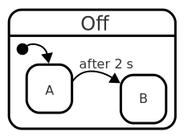

# Compound State

A compound state is a [state](state.html){:.glossary} that includes one or more substates.  This is perhaps main differentiating factor between traditional state machines and statecharts.

If there are more than one substates, one of them is usually designated as the [initial](initial.html){:.glossary} state of that compound state.

When a compound state is active, its substates behave as though they were an active state machine:  Exactly one child state must also be active.

* When a compound state is entered, it must also enter one of its substates, usually its initial state.
* When a compound state exits, its substate is simultaneously exited too.
* When a substate transitions to another substate, both "inside" the compound state, the compound state does _not_ exit or enter; it remains active.
* When an event happens, the _substates_ of the compound state get to act on the state before the compound state itself gets to act on it.  If a substate handles an event, the compound state doesn't get to see it.

Compound states may be nested, or include [parallel](parallel-state.html){:.glossary} states.

The opposite of a compound state is an [atomic state](atomic-state.html){:.glossary}, which has no substates.

## Usage

When designing a statechart, the act of changing an atomic state into a compound state, by introducing a substate or two, is called _refining_ the state.  The refinement alludes to the different behaviour encoded in the substates as being a _refinement_ of the generic behavour of the compound state.  The component generally behaves in the way the compound state declares (by looking at the compound state's transitions), but depending on which substate is active, and which transitions they define, the component might behave differently.

A compound state is allowed to define [transitions](transition.html]{:.glossary} to its child states. Normally, when a transition leads from a state, it causes that state to be exited.  For transitions from a compound state to one of its descendantes, it is possible to define a transition that avoids exiting and entering the compound state itself, such transitions are called [local transitions](local-transition.html]{:.glossary}. 

## Notation

A compound state is a normal state with its substates depicted _inside_ the borders of the state itself:



Here, the state called **Off** is a compound state.  It has two states **A** and **B** as its substates.  Note how the substates constitute their own state machine, even with an [initial state](initial-state.html){:.glossary}.

In UML, compound states are called _composite states_.

## Zooming in and out

The nesting of states in a hierarchy can lead to complicated charts when it is visualized.  It is possible to conceal the internals of a compound state by excluding substates from the visualization.  This technique is called _zooming out_.  Zooming _in_ would then reveal the details.

## SCXML

In Statechart XML, a compound state is any state with nested state elements as direct children; this includes `<parallel>`, `<initial>` elements too, as these are also state elements. 

``` xml
<state id="off">
  <state id="A"/>
  <state id="B"/>
</state>
```

## xstate

An xstate compound state is declared using the `states` property of the state, holding an object containing substates.  Each key value pair declares the name and definition of the state, respectively:

``` javascript
"off": {
  "initial": "A",
  "states": {
    "A": {  },
    "B": {  }
  }
}
```

The definitions of A and B have been omitted.

## SCION-CORE

In SCION-CORE, a compound state is declared by specifying the `states` property of the state in question, containing an array of state objects.  Unless explicitly specified using the `initial` property, the first item in the state becomes the initial state.

``` javascript
{
  id: "off",
  states: [
    {
      id: "A",
    },
    {
      id: "B",
    }
  ]
}
```
