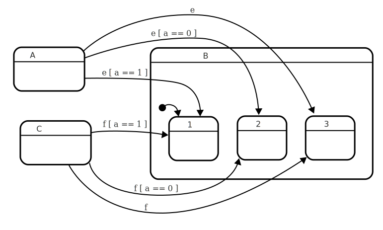
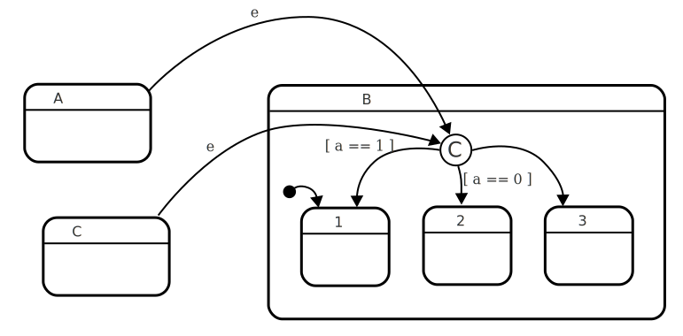

# Condition state

A condition state is a state that essentially consists _solely_ of [automatic](automatic-transition.html){:.glossary}, [guarded](guard.html){:.glossary} [transitions](transition.html){:.glossary}, so that upon entry, the state will always immediately exit to another state. A condition state is used to group similar sets of incoming transitions, so that the guards of those transitions don't need to be repeated. It can also be used to simplify entry to a state, by allowing the source of a transition to target a single condition state, where the choice of target state happens.

To be called a condition state, there should be no actions or activities defined in the state. Condition states do not have child states. All transitions must be automatic, and care must be taken when defining the guards, to ensure that at least one transition will always be taken. This is usually done by including one unguarded automatic transition.

## Notation

Harel's original paper defined a condition state to be denoted using a capital letter C enclosed by a circle.


Note that in UML, _junction states_ and _choice states_ are similar to condition states, and use slightly different notation: Junction states are denoted by an opaque, black circle, while choice states are denoted by a diamond.

## Usage

Statecharts can easily get cluttered when the number of states increases. Not necessarily due to the number of states, but rather the number of transitions between the states. Condition states allow you to combine similar transitions thereby reducing the number of lines connecting the various states. The usefulness is increased if many of the transitions have the same guard conditions.

Condition states are often used in two ways:

- Reduce the number of transitions from a compound state that end up in the same target, by combining the transitions in the source state.
- Combine several guarded transitions going in to a compound state (that come from the same source). This is known as a conditional entry to a state.

When making changes to a statechart, it is often the case that you need similar sets of guards to control different states. In the following example, we have two main states A and B, where state A has three separte transitions for event _e_, each leading to a specific substate of B. The choice of which substate we end up in is determined by the individual guards.

**The guards that determine the final source, are outside the compound state B.**{:.caption}


The problem is apparent if you try to introduce another state, say C, which also needs to enter the same substates of B, based on similar, or identical guards:

**By adding a single state C, which has transitions similar to A, we had to duplicate many guards.**{:.caption}


By defining a condition state inside the compound state itself, the guard definitions are closer to the target states, making the statechart easier to reason about. Let's remove state C again, and instead first introduce the _condition state_:

**The guards that determine the correct substate of B are now inside B, and state A is already easier to understand. It also becomes easier to make changes to the statechart.**{:.caption}


Now, it becomes a lot easier to introduce the C state, without doubling the amount of transitions. Now, since we have a state that represents the _conditional entry_, we can re-use that condition state by transitioning to it:

**The guards that determine the state of B are inside B, and states A and C are easier to understand.**{:.caption}


Condition states can help reduce clutter when introducing states and a whole set of transitions need to be copied over to a new state, or when several different events need similar sets of guards. In such situations, consider introducing a condition state to encapsulate the logic. Condition states can also help move guards closer to the target states, where this is desirable.

## SCXML

Condition states are not native to SCXML, but can easily be implemented by making a `<state>` element that consists only of automatic guarded transitions, ensuring that being in the state has no other effects than transitioning to another state:

**`B_COND` is a condition state, used to provide a conditional entry to state B.**{:.caption}

```xml
<state id="A">
  <transition target="B_COND" event="e"/>
</state>

<state id="B">
  <state id="B1"/>
  <state id="B2"/>
  <state id="B3"/>
  <state id="B_COND">
    <transition target="B1" cond="a == 1"/>
    <transition target="B2" cond="a == 0"/>
    <transition target="B3"/>
  </state>
</state>
```

Here we have a state A which, on event "e" will transition to B_COND, which is a condition state, because it consists only of automatic, guarded transitions. When in state A, and the event "e" happens:

- A will exit and enter B_COND.
- Being in B_COND will immediately evaluate the guard `a == 1` and go directly to B1 if this is true.
- Otherwise, B_COND will evaluate the guard `a == 0` and go to B2 if this is true.
- Otherwiser, B_COND will go to B3.

This offers many benefits:

- If this were to be implemented without the condition states, the transitions with `cond` logic would be in state `A`, whereas it is probably wiser to keep this logic closer to the states B1, B2 and B3.
- If more events (e.g. `<transition target="B_COND" event="e2"/>`), or more sources of events (e.g. other than from `A`) lead to the same guarded transitions, a condition state reduces the amount of transitions that need to be defined.

## XState

Condition states are not native to XState, but can easily be implemented by making a state that consists only of automatic, guarded transitions, ensuring that being in the state has no other effects than transitioning to another state.

**`COND` is a condition state, used to provide a conditional entry to state B.**{:.caption}

```javascript
{
  states: {
    A: {
      on: {
        e: "B.COND"
      }
    },
    B: {
      initial: "1",
      states: {
        1: {},
        2: {},
        3: {}
        COND: {
          on: {
            '': [
              { target: "1", cond: (ctx, event) => ctx.a == 1 },
              { target: "2", cond: (ctx, event) => ctx.a == 0 },
              { target: "3" }
            ]
          }
        }
      }
    }
  }
}
```

Here we have a state "A" which, on event "e" will transition to "B.COND", which is a condition state, because it consists only of automatic, guarded transitions. When in state A, and the event "e" happens:

- A will exit and enter B.COND.
- Being in COND will immediately evaluate the guard `a == 1` and go directly to "1" if this is true.
- Otherwise, COND will evaluate the guard `a == 0` and go to "2" if this is true.
- Otherwiser, COND will go to "3".

This offers many benefits:

- If this were to be implemented without the condition states, the transitions with `cond` logic would be in state `A`, whereas it is probably wiser to keep this logic closer to the states B.1, B.2 and B.3.
- If more events (e.g. `on: {e2: "B.COND"}`), or more sources of events elsewhere in the statechart (e.g. other than from `A`) lead to the same choices being made, a choice state reduces the amount of transitions that need to be defined.

## Relation to UML choice and junction states

UML defines the terms _junction state_ and _choice state_ which are similar to Harel's definition of condition states, but with slightly different semantics.
