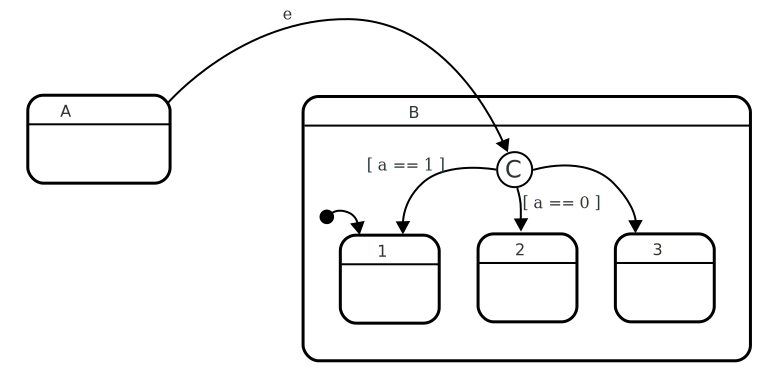

# Condition state

A condition state is a state that essentially consists _solely_ of [automatic](automatic-transition.html){:.glossary}, [guarded](guard.html){:.glossary} [transitions](transition.html){:.glossary}, so that upon entry, the state will always immediately exit to another state.  A condition state is used to group similar sets of incoming transitions, so that the guards of those transitions don't need to be repeated.  It can also be used to simplify entry to a state, by allowing the source of a transition to target a single condition state, where the choice of target state happens.

To be called a choice state, there should be no actions or activities defined in the state.  Choice states do not have child states.  All transitions must be automatic, and care must be taken to ensure that at least one transition will always be taken. This is usually done by including one unguarded automatic transition.

Condition states can help reduce clutter when introducing states and a whole set of transitions need to be copied over to a new state, or when several different events need similar sets of guards.  In such situations, consider introducing a condition state to encapsulate the logic.  Condition states can also help move conditional logic (which is essentially what guards are) closer to the target states.

## Notation

A condition state is denoted by way of a capital letter C enclosed by a circle.



Note that in UML, _junction states_ and _choice states_ are similar to condition states, and use slightly different notation:  Junction states are denoted by an opaque, black circle, while choice states are denoted by a diamond.

## SCXML

Condition states are not native to SCXML, but can easily be implemented by making a `<state>` element that consists only of guarded transitions, ensuring that being in the state has no other effects than transitioning to another state:

``` xml
<state id="A">
  <transition target="B_CHOICE" event="e"/>
</state>

<state id="B">
  <state id="B1"/>
  <state id="B2"/>
  <state id="B3"/>
  <state id="B_CHOICE">
    <transition target="B1" cond="a == 1"/>
    <transition target="B2" cond="a == 0"/>
    <transition target="B3"/>
  </state>
</state>
```

Here we have a state A which, on event "e" will transition to B_CHOICE, which is a choice state, because it consists only of automatic, guarded transitions.  When in state A, and the event "e" happens:

* A will exit and enter B_CHOICE.
* Being in B_CHOICE will immediately evaluate the guard `a == 1` and go directly to B1 if this is true.
* Otherwise, B_CHOICE will evaluate the guard `a == 0` and go to B2 if this is true.
* Otherwiser, B_CHOICE will go to B3.

This offers many benefits:

* If this were to be implemented without the choice states, the transitions with `cond` logic would be in state `A`, whereas it is probably wiser to keep this logic closer to the states B1, B2 and B3.
* If more events (e.g. `<transition target="B_CHOICE" event="e2"/>`), or more sources of events (e.g. other than from `A`) lead to the same choices being made, a choice state reduces the amount of transitions that need to be defined.

## XState

Condition states are not native to XState, but can easily be implemented by making a state that consists only of guarded transition, ensuring that being in the state has no other effects than transitioning to another state:

``` xml
{
  states: {
    A: {
      on: {
        e: "B.CHOICE"
      }
    },
    B: {
      initial: "1",
      states: {
        1: {},
        2: {},
        3: {}
        CHOICE: {
          on: {
            '': [
              { target: "1", cond: (e, xs) => xs.a == 1 },
              { target: "2", cond: (e, xs) => xs.a == 0 },
              { target: "3" }
            ]
          }
        }
      }
    }
  }
}
```

Here we have a state "A" which, on event "e" will transition to "B_CHOICE", which is a choice state, because it consists only of automatic, guarded transitions.  When in state A, and the event "e" happens:

* A will exit and enter B.CHOICE.
* Being in CHOICE will immediately evaluate the guard `a == 1` and go directly to "1" if this is true.
* Otherwise, CHOICE will evaluate the guard `a == 0` and go to "2" if this is true.
* Otherwiser, CHOICE will go to "3".

This offers many benefits:

* If this were to be implemented without the choice states, the transitions with `cond` logic would be in state `A`, whereas it is probably wiser to keep this logic closer to the states B.1, B.2 and B.3.
* If more events (e.g. `on: {e2: "B_CHOICE"}`), or more sources of events elsewhere in the statechart (e.g. other than from `A`) lead to the same choices being made, a choice state reduces the amount of transitions that need to be defined.

## Relation to UML choice and junction states

UML defines junction states and choice states similarly, but with slightly different semantics.
