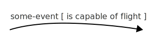

# Guard

_Also known as **Conditional transition**_

A guard is a condition that may be checked when a statechart wants to handle an [event](event.html){:.glossary}.  A guard is declared on the [transition](transition.html){:.glossary}, and when that transition _would_ trigger, then the guard (if any) is checked.  If the guard is _true_ then the transition does happen. If the guard is false, the transition is ignored.

## Notation

A guard is added after the event name, in square brackets:



The notation does not prescribe any particular syntax of the text inside brackets—the guard itself.  It does not have to be executable code:  For hand drawn statecharts, a simple sentence is enough.

## Usage

When transitions have guards, then it's possible to define two or more transitions for the same event from the same state, i.e. that a state has _two_ (or more) transitions for the same event.  When the event happens, then the guarded transitions are checked, one by one, and the first transition whose guard is true will be used, the others will be ignored.

A guard is generally a boolean function or boolean variable.  It must be evaluated _synchronously_ — A guard can for example not wait for a future or promise to resolve — and should return immediately.

A guard function must not have any side effects.  Side effects are reserved for [actions](action.html){:.glossary}.  Likewise, a unit test that verifies a statechart's behaviour should _not_ require a guard function to be called; but simply set up guard functions (or variables) so that they might be called and return the values as defined in the test itself.

A guard function is de facto a part of the API surface between the component and the statechart.  A component will typically expose a set of things that the statechart is allowed to check.

Guard functions are often called _while processing an external event_ so this must obviously be possible.  However, the statechart should be allowed to check any guard at any time, i.e. also while _not_ processing any event.  This is to allow the author of the statechart to be free to use things like [delayed events](delayed-event.html){:.glossary} or [delayed transitions](delayed-transition.html){:.glossary}.

## In and Not In guards

A special type of guard checks which _other_ states that the state machine is in, e.g. in [parallel states](parallel-state.html){:.glossary}.  The notation is generally the word "in" followed by the name of the state:

* "in A" means that the transition should only be taken if the machine is _currently_ in the A state
* "not in A" means that the transition should only be taken if the machine is _not_ in the A state

An _In_ guard can act as a way to introduce a certain amount of coordination between different parts of a statechart.  For example, its possible to cause an event to have different behaviour depending on the state of another part of the machine.

## Critisism

It should be noted that a guard is an _if_ test, exactly the type of if tests that lead to problems and complexity in traditional event processing code.  Heavy use of guards with complicated guard conditions should be avoided.

## SCXML

In Statechart XML, the guard is specified using ]the `cond` attribute on the `<transition>` element](https://www.w3.org/TR/scxml/#transition):

```xml
<transition event="some-event" cond="is_capable_of_flight()" target="some-other-state" />
```

Again, the set of guard functions available to the statechart is up to you, and again you can expose low level information from your component (such as character count), or higher level, more "business related" guards (such as "is valid" or word count).

"In" guards are provided by a required built-in function called `In`:

```xml
<transition event="some-event" cond="In('A')" target="some-other-state" />
```

## XState

XState supports [guard functions](https://xstate.js.org/docs/guides/guards.html) in the machine definition:

```
on: {
  "some-event": [{
    target: "some-other-state",
    cond: "is_capable_of_flight"
  }]
}
```

The guard function can be provided in-line, but if not, should be provided to the XState interpreter.


"In guards" are supported declaratively:

```
on: {
  "some-event": [{
    target: "some-other-state",
    in: "A"
  }
}
```

