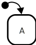

When a state machine starts, it starts by [entering](enter.html){:.glossary} the machine's **initial state**. Likewise, when a [compound state](compound-state.html){:.glossary} is entered, _its_ **initial state** is also entered. The initial state is not a separate state, but more like an indication of which state that the machine should _start_ in by default.

A [transition](transition.html){:.glossary} from a different state can target a substate of a compound state, thereby bypassing the state's initial state. An initial state should be thought of as the default starting point of a compound state if a transition points directly to the compound state.

## Notation

A state machine, or compound state's _initial_ state is specified by way a black circle with exactly one transition arrow to a sibling state that should be entered. The black circle and arrow have no name, it is the target state that is called the "initial" state.



## Usage

Initial states are impossible to avoid, and follows from the definition of compound states: For a compound state, whenever it becomes active, exactly one of its direct children are also active. The "initial" state simply denotes _which_ of the child states become active when this happens.

Picking the right initial state can help decouple the various parts of the statechart. It allows transitions to target the compound (parent) state instead of a child directly. This allows collapsing the view of a compound state to see the bigger picture.

## SCXML

In Statechart XML, the initial state is denoted in one of these ways:

- Using the `initial` attribute of the `<state>` element:
  ```xml
  <state id="P" initial="A">
    <state id="B" />
    <state id="A" />
  </state>
  ```
- Using the `<initial>` element instead of a `<state>` element. The `<initial>` element is identical to any other `<state>` except that it is an `<initial>` state.
  ```xml
  <state id="P">
    <state id="B" />
    <initial id="A" />
  </state>
  ```
- Implicitly, by relying on document order, the first `<state>` element will be the initial state:
  ```xml
  <state id="P">
    <state id="A" />
    <state id="B" />
  </state>
  ```

## XState

In XState, a compound state must have the `initial` property declaring the key of the initial child state node.

```js
"P": {
  "type": "compound", // optional
  "initial" : "A",
  "states" : {
    "A": {},
    "B": {}
  }
}
```
