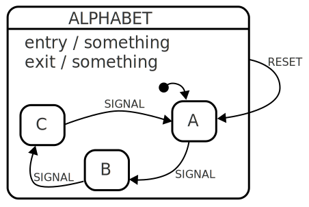
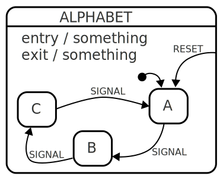

# Local transition

**Also known as _Internal transition_**, **Opposite of _External transition_**

A transition from a [compound state](compound-state.html){:.glossary} to its direct children normally causes the _compound_ state to exit, then enter again.  In a local transition, the compound state does not enter and exit again.

Consider the following state:



The state starts out in state A, but the "SIGNAL" signal moves it between its substates, A, B and C.  The transitions between A, B, C don't cause the top level state S to exit, so the SIGNAL state does not, for example cause the entry or exit actions to happen.

But the "RESET" signal however, goes _from_ state S _to_ state A.  If this is a normal transition, it would cause state S to _exit_ and then _enter_ again, before finally enter A.  However, sometimes the exit and entry of state S is unwanted.  IF RESET is declared to be a local transition, it does not exit the source state.

Local transitions are only possible to define _from_ a composite state and _to_ its children, or _from_ a child to its containing _ancestor_.

## Notation



## XState

In XState, an internal transition is described by prefixing the target state with a dot.

```
{
  initial: 'A',
  onEntry: 'something',
  onExit: 'something',
  on: {
    RESET: '.A'
  },
  states: {
    A: {
      on: { SIGNAL: 'B' }
    },
    B: {
      on: { SIGNAL: 'C' }
    },
    C: {
      on: { SIGNAL: 'A' }
    }
  }
}
```


You can also specify an internal transition more explicitly:

```javascript
on {
  RESET: [
    { target: 'A', internal: true }
  ]
}
```

Important to note that `internal: false` is the default, taking the lead from SCXML.

See [xstate.js.org/docs/guides/transitions.html#internal-transitions](https://xstate.js.org/docs/guides/transitions.html#internal-transitions) for more information.

## SCXML

SCXML's `<transition>` has a `type` attribute which can be set to `internal` to declare a transition as local:

```
<state id="ALPHABET" initial="A">
  <onentry>something</onentry>
  <onexit>something</onexit>
  <transition event="RESET" target="A" type="internal" />
  <state id="A">
    <transition event="SIGNAL" target="B"/>
  </state>
  <state id="B">
    <transition event="SIGNAL" target="C"/>
  </state>
  <state id="C">
    <transition event="SIGNAL" target="A"/>
  </state>
</state>
```

## Sources

[Wikipedia](https://en.wikipedia.org/wiki/UML_state_machine#Local_versus_external_transitions)

[UML](http://www.omg.org/spec/UML/) defines local and external transitions in `TransitionKind` as:

> * local — Implies that the Transition, if triggered, will not exit the composite (source) State, but it will exit and re-enter
any state within the composite State that is in the current state configuration.
> * external — Implies that the Transition, if triggered, will exit the composite (source) State.
