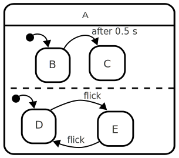
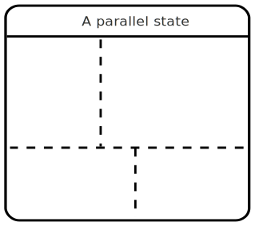

# Parallel state

A parallel state is a [state](state.html){:.glossary} that is divided into separate regions.  Each region contains more substates.  When a parallel state is entered, _each_ of the regions are also entered; their [initial states](initial-state.html){:.glossary} are entered and so on.



If the state above is entered, both B and D states are entered too.  As you can see the _flick_ event is handled by both B _and_ D.  If the _flick_ event happens, _both_ B and D get to "handle" the event, and the resulting state is C _and_ E.

If another _flick_ event happens E will transition back to D, while C will ignore the event, since C doesn't handle the event.  After 1 second, C will transition back to B, ready to handle the _flick_ event again.

## Notation

A parallel state is like any other state, but it is subdivided into regions by way of straight, dashed lines.  Each such region can then include states.



Each of those regions can hold their own sets of states

## SCXML

In Statechart XML, [the `<parallel>` element](https://www.w3.org/TR/scxml/#parallel) declares a parallel state.  It has more or less exactly the same set of attributes and elements as the `<state>` element, except it has no _initial_ or _final_ states.  The various _regions_ are defined by way of the direct child `<state>` elements.

This is a parallel state with two _regions_. When `p` becomes active, so does `foo1` and `bar1`

``` xml
<parallel id="p">
  <state id="region1">
    <state id="foo1"/>
    <state id="foo2"/>
  </state>
  <state id="region2">
    <state id="bar1"/>
    <state id="bar2"/>
  </state>
</parallel>
```

## xstate

In xstate, the `parallel` attribute must be set to `true` for a state to be marked as a parallel state with regions.  A parallel state can not define an `initial` property, since all regions are entered simultaneously.

```
p: {
  parallel: true,
  states: {
    region1 : {
      initial: 'foo1',
      states: {
        foo1: {}
        foo2: {}
      }
    },
    region2 : {
      initial: 'bar1',
      states: {
        bar1: {}
        bar2: {}
      }
    }
  }
```
