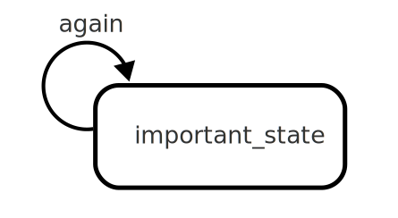

# Self transition

A self transition is a [transition](transition.html){:.glossary} that starts and ends in the same state.  When a self state is executed, the state in question is [exited](exit.html){:.glossary} and [entered](entry.html){:.glossary} again.

## Notation

A transition from the state to itself is depicted as a segment of a circle:



It is important to note that self transitions (or transitions to own child states) will in fact _exit_ the state in which the transition starts.  This is important to keep in mind and can be a source of confusion, since it leads to the _exit_ and _entry_ actions of the state to be re-executed.

For [compound states](compound-state.html){:.glossary} this means that all substates are exited, and any [initial states](initial-state.html){:.glossary} are entered. 

## xstate

In xstate, a self transition is defined as any other transition, listing the name of the state as usual:

```json
"important_state": {
  "on": {
    "again" : "important_state"
  }
}
```

## SCXML

In Statechart XML, a self transition uses the standard `<transition>` syntax.

```xml
<state id="important_state">
  <transition event="again" target="important_state"/>
</state>
```

