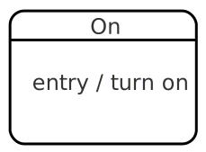

# State

A state in a state machine describes a particular behaviour of the machine.  When we say that a machine is "in" a state, it means that the machine behaves in the way that state describes.

The behaviour of a state is defined as how the state reacts to [events](event.html){:.glossary}.  Each state can specify a number of events that it "understands", and specifies, for each event, any number of [transitions](transition.html){:.glossary} that could be taken, if that event happens.  A state also describes a set of [actions](action.html){:.glossary} to execute when the state is entered or exited, and in some implementations, [activities](activity.html){:.glossary} that should be happening for the entire duration of time that the machine is _in_ the state.

A state usually has a name, but some systems allow for anonymous states.

When a state machine is _executed_, it [enters](entry.html){:.glossary} the [initial state](initial-state.html){:.glossary}, and adopts the behaviour associated with that state.  As the machine handles events, it transitions to other states, thus changing the behaviour of the machine over time.


## States in statcharts

There are a couple of special types of states in statecharts:

* [Compound or composite states](compound-state.html){:.glossary}, which allow a state to define variants of its defined behaviour, by way of an internal state machine.
* [Parallel or orthogonal states](parallel-state.html}{:.glossary}, which is somewhat like a compound state, but where multiple subordinate separate state machines are active simultaneously.
* [Atomic or simple states](atomic-state.html){:.glossary}, which has no substates.

## Hierarchy

These constructs allow statecharts to be hierarchically organized.  When a compound state is active (when the machine is _in_ that state), exactly one of its child states are also active.  When a parallel state is active, by definition, all of the child states (called regions) are also active.  This implies that in a hierarchically organized statechart, many states can be active at any point in time.  Specifically, for each active atomic state, all the compound and parallel parents are also deemed to be "active".  When an event happens, the "deepest" of the states get to handle the event, pre-empting the behaviour of the parent states that contain it.

## Notation

A state is generally depicted as a rounded box, with the name of the state centered at the top of the box, with a horizontal line sparating the name of the state from the actions and activities.  The original statechart paper did not have these lines, they come from the UML Statechart standard.  It is common to drop this line in states that have no substates and no actions.

Transitions _from_ this state are depicted as curvy lines pointing away.  Transitions _to_ this state are depicted as curved lines that point to this state.

Entry and Exit actions are written in text form inside the state.



## SCXML

In SCXML, a state is defined by the `<state>` element, with the name of the state in its `id` attribute.  An empty state:

``` xml
<state id="my_state"/>
```

The child elements of the `<state>` include entry and exit actions, transitions, along with substates:

``` xml
<state id="my_state">
  <onentry>
    <script>do_something()</script>
  </onentry>
  <transition event="some_event" target="some_other_state"/>
  <state id="my_substate">
    <transition event="some_event" target="my_other_substate"/>
  </state>
  <state id="my_other_substate"/>
</state>
```


## xstate

In xstate, a state is specified as a named object in the `states` property of a state machine or compound state.  The key becomes the name of the state, and the object defines the state's behaviour.

Here's an empty state called `my_state`:

```
{
  states: {
    my_state: {}
  }
}
```

Here's the `my_state` with an action, transitions, and substates:

```
{
  states: {
    my_state: {
      onEntry: "do_something",
      on: {
        some_event: "some_other_state"
      },
      states: {
        my_substate: {
          on: {
            some_event: "my_other_substate"
          }
        },
        my_other_substate: {}
      }
    }
  }
}
```

## SCION-CORE

In SCION Core, a state is described by an object with an `id` property, denoting the identifier of the state.

``` javascript
{
  id: "my_state"
}
```

Here's the same state with an action, transitions, and substates:

``` javascript
{
  id: "my_state",
  onEntry: function(event) {
    do_something();
  },
  transitions: [
    {
      event: "some_event",
      target: "some_other_state"
    }
  ],
  states: [
    {
      id: "my_substate",
      transitions: [
        {
          event: "some_event",
          target: "my_other_substate"
        }
      ]
    },
    {
      id: "my_other_substate"
    }
  ]
}
```
