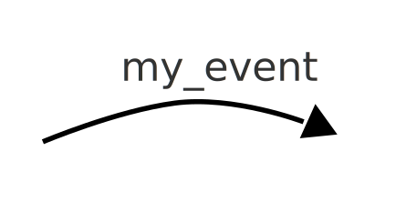
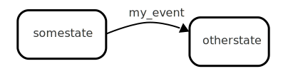

# Transition

In en executing state machine, a transition is the instantaneous transfer from one [state](state.html){:.glossary} to another.  When defining a state machine, a transition defines what happens when certain conditions arise, most often triggered by an [event](event.html){:.glossary}.

When an event happens, the currently active state(s) are inspected to see if any of the outbound transitions should be triggered by the event.  When a transition is found, it is _executed_ by [exiting](exit.html){:.glossary} the state in question, and [entering](enter.html){:.glossary} the state that the transition points to.

A [self transition](self-transition.html){:.glossary} is a transition that goes from and to the same state.

## Notation

A transition is depicted as a curved arrow.  The name of the event that triggers the transition is written close by, perhaps on top of the arrow.



The transition always sits between two distinct states



The state that the arrow points _from_ is the state in which the event in question is handled.  The state that the arro points _to_  is the state that the state machine ends up in, if the transition is executed.

## xstate

In xstate, a transition is defined using the `on` property of a state. The key is the event in question, and the value is the name of the target state.

```json
"somestate": {
  "on": {
    "my_event" : "otherstate"
  }
}
"otherstate": {
  ...
}
```

## SCXML

In Statechart XML, a transition is a `<transition>` element nested inside the `<state>` element to which it applies.  The `target` attribute identifies the state to which it points, while `cond` is used for the guard.

```xml
<state id="somestate">
  <transition event="my_event" target="otherstate"/>
</state>
<state id="otherstate">
  ...
</state>
```


