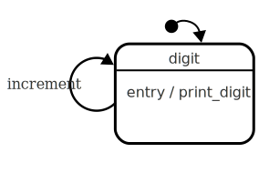
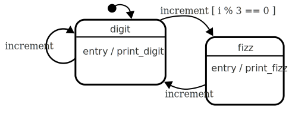
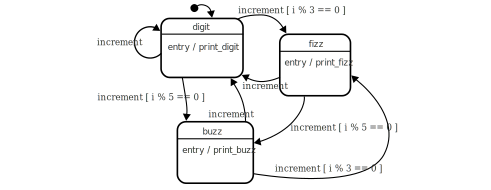
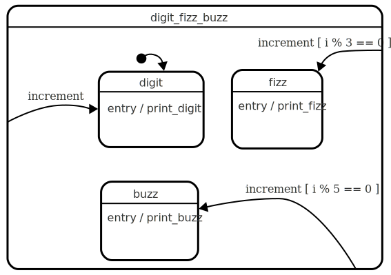
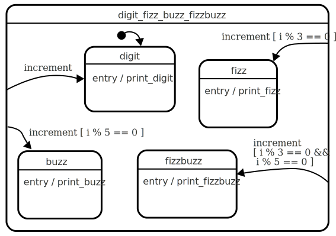

# FizzBuzz with Actions and guards

FizzBuzz is a programming puzzle, easily solvable using a simple for-loop.  The puzzle has been described in terms of an event driven system, in order to allow us to explore some statechart concepts.  See [FizzBuzz](fizzbuzz.html) for an explanatory introduction.

Here, we will show how [actions](glossary/action.html){:.glossary} can be used to let the statechart tell us what to do.  We will use [guards](glossary/guard.html){:.glossary} to tell the statechart which state it should be in.  Note that this is not an endorsement to use statecharts to solve FizzBuzz!

## Start with digits

Let’s start with a machine that prints out only the digits.

**This simple statechart re-enters the _digit_ state every _increment_ event.**{:.caption}

This machine remains in the _digit_ state, constantly re-[entering](glossary/enter.html){:.glossary} itself when it's passed the `increment` event.  A transition that goes from one state and back to itself is called a [self transition](glossary/self-transition.html){:.glossary}.  When it re-enters itself, it invokes the digit state's entry [action](glossary/action.html){:.glossary}.  Those actions are how we're going to ask the statechart what needs to be done.

Here is the xstate equivalent:

**This statechart represents the diagram above, in xstate syntax**{:.caption}
``` javascript
const statechart = {
  initial: 'digit',
  states: {
    digit: {
      on: {
        increment: 'digit'
      },
      onEntry : 'print_digit'
    }
  }
}
```

The statechart definition needs to be passed to the `xstate.Machine` function.  This `machine` provides us with the _initial_ state, and a way to jog the state machine (`transition()`).  The following code goes through a for loop, which increments 'i', and sends the machine an event called _increment_.

**This loop "generates" an event every iteration.**{:.caption}
``` javascript
const machine = Machine(statechart);

state = machine.initialState;
for (i = 1; i < 100; i++) {
  state = machine.transition(state, 'increment', i);
}
```

We'll set up a little dictionary of actions, corresponding to the actions mentioned in the statechart.  At the moment, all we need is `print_digit`.

**Any side effects should be executed after every `transition()`.**{:.caption}
``` javascript
const actions = {
  print_digit: (i) => console.log(i)
}

for (i = 1; i < 100; i++) {
  state = machine.transition(state, 'increment', i)
  state.actions.forEach(item => actions[item](i));
}
```

This code should print out the digits 1 through 100.  In the embedded codepens I've replaced the console.log with `document.write('<li>' + i + '</li>')`

<p data-height="455" data-theme-id="light" data-slug-hash="aKmZow" data-default-tab="js" data-user="mogsie" data-embed-version="2" data-pen-title="FizzBuzz with actions and guards 1: Digits only" class="codepen">See the Pen <a href="https://codepen.io/mogsie/pen/aKmZow/">FizzBuzz with actions and guards 1: Digits only</a> by Erik Mogensen (<a href="https://codepen.io/mogsie">@mogsie</a>) on <a href="https://codepen.io">CodePen</a>.</p>
<script async src="https://static.codepen.io/assets/embed/ei.js"></script>

### Checkpoint

We have a simple machine that has a single state.  We've shown how a [self transition](glossary/self-transition.html){:.glossary} can be used to re-enter a state, solely to trigger entry [actions](glossary/action.html){:.glossary} every time an event is fired.

## Adding Fizz

Now let’s change the behaviour so that it prints out Fizz when the counter is divisible by 3.  Printing out Fizz is a different _action_ than printing out the digit, so our goal is to ensure that the new `print_fizz` action only happens when it should, and that the `print_digit` action is _not_ fired.

We will introduce a new state, `fizz` with the `print_fizz` action.  When the `increment` event happens, we will alternate between the two states, and use the onEntry actions on each state to cause the desired side effect.

The statechart diagram we're aiming for looks something like this:

**Updated diagram with new _fizz_ state.**{:.caption}

Let's introduce the new _fizz_ state, with its entry action _print_fizz_:

**The new _fizz_ state, with the `print_fizz` action.**{:.caption}
``` javascript
states: {
  digit: {
    ...
  },
  fizz: {
    onEntry : 'print_fizz'
  }
}
```

The new action `print_fizz` should be added to the action dictionary:

**The `print_fizz` action now in the `actions` dictionary.**{:.caption}
``` javascript
const actions = {
  print_digit: (i) => console.log(i),
  print_fizz: () => console.log('Fizz')
}
```

We want to transition from _digit_ to _fizz_ whenever the number is incremented, and divisible by 3.  So we have to change the event definitions in the _digit_ state:

**The transitions defined in the `digit` state.**{:.caption}
``` javascript
on: {
  increment: [
    { cond: (i) => i%3==0, target: 'fizz' },
    { target: 'digit' }
  ]
}
```

This (the `on.increment[]` array) is essentially a series of if-tests, which are evaluated when we're in this state:  It can be read as follows:

 * First, if `i%3 == 0` then we go to the _fizz_ state
 * Otherwise, we go to the _digit_ state.

In the _fizz_ state, we know that we'll never be in the _fizz_ state immediately after a _fizz_ state, so the _fizz_ state can simply transition to _digit_ with no checks:

**The transitions defined in the `fizz` state.**{:.caption}
``` javascript
on: {
  increment: 'digit'
}
```

Here's the final code for the "fizz only" solution:

<p data-height="455" data-theme-id="light" data-slug-hash="XYjKmR" data-default-tab="js" data-user="mogsie" data-embed-version="2" data-pen-title="FizzBuzz with actions and guards 2: Fizz" class="codepen">See the Pen <a href="https://codepen.io/mogsie/pen/aKmZow/">FizzBuzz with actions and guards 1: Fizz</a> by Erik Mogensen (<a href="https://codepen.io/mogsie">@mogsie</a>) on <a href="https://codepen.io">CodePen</a>.</p>

This machine has two states, and every time it gets the ‘increment’ event, depending on which state it's in, it might evaluate the condition, and transitions to _fizz_ or _digit_ appropriately.  

### Checkpoint

We've shown how to use a [guard](glossary/guard.html){:.glossary} condition to make a transition only happen under certain circumstances.  Perhaps more subtly, we've shown that the behaviour can be changed by making changes to the statechart definition itself.

## Adding support for Buzz

The steps involved in adding support for printing "Buzz" is somewhat similar to addding "Fizz", but there are some important differences, which will be explained.

First of all, we need a new action, `print_buzz`, which lives in the action dictionary:

**The `print_fizz` action added to the actions dictionary.**{:.caption}
``` javascript
const actions = {
  print_digit: (i) => console.log(i),
  print_fizz: () => console.log('Fizz'),
  print_buzz: () => console.log('Buzz')
}
```

We'll also need the _buzz_ state, with its entry action _print_buzz_:

**The new `buzz` state, invoking the right action.**{:.caption}
``` javascript
states: {
  digit: {
    ...
  },
  fizz: {
    ...
  }
  buzz: {
    onEntry : 'print_buzz'
  }
}
```

So far, so good!  On to defining the transitions.  We will use another guarded transition, this time, with the guard `i % 5 == 0`.

* The _digit_ state already checks for 'fizz', now the state also needs a transition to _buzz_ if divisible by 5.
* The same check needs to happen in Fizz too.
* When in buzz we need to check if it's divisible by 3, and transition to _fizz_, like the _digit_ state does.

We can already see that there is some redundancy, it becomes clearer in the statechart diagram:

**The statechart with digit, fizz, and buzz states.  The number of transitions increases noticably.**{:.caption}

There are a number of transitions that are identical, and this is by definition a maintenance burden.  Imagine adding support for FizzBuzz; it would require another state, but six or more transitions, many of them duplicates.

We can use the hierarchical nature of statecharts to solve this particular problem, making it both easier to describe, and easier to maintain:

* Introduce a [compound state](glossary/compound-state.html){:.glossary} _around_ the three states.
* Move common transitions from the substates to the parent state.

The diagram ends up looking like this:

**The introduction of a compound state results in a much simpler diagram.**{:.caption}

This is clearly a simpler model, where the logic to choose which transition to pick has been moved to the superstate.  In our xstate code, the statechart is defined as follows:

**The xstate definition for the statechart diagram above.**{:.caption}
``` javascript
{
  initial: 'digit_fizz_buzz',
  states: {
    digit_fizz_buzz: {
      initial: 'digit',
      on: {
        increment: [
          { cond: (i) => i%3==0, target: '.fizz' },
          { cond: (i) => i%5==0, target: '.buzz' },
          { target: '.digit' }
        ]
      },
      states: {
        digit: {
          onEntry : 'print_digit'
        },
        fizz: {
          onEntry : 'print_fizz'
        },
        buzz: {
          onEntry : 'print_buzz'
        }
      }
    }
  }
}
```

The machine now has a single root state, `digit_fizz_buzz` which has

* three substates
* three transitions on the 'increment' event, one to each of the substates.

When the state machine is running, it automatically enters the _digit_fizz_buzz_ state, which means it will react to the events defined at that level, except if a substate also defines transitions for the same events.  In our case, none of the substates _digit_, _fizz_, nor _buzz_ have any transitions defined.  When any of the transitions fires, it _leaves_ the currently active state, whatever it is, and _enters_ the one that is the target of that transition.

Here's the current solution, with Fizz and Buzz, but no FizzBuzz just yet:

<p data-height="455" data-theme-id="light" data-slug-hash="jKMrPP" data-default-tab="js" data-user="mogsie" data-embed-version="2" data-pen-title="FizzBuzz with actions and guards 2: Fizz Buzz" class="codepen">See the Pen <a href="https://codepen.io/mogsie/pen/aKmZow/">FizzBuzz with actions and guards 2: Fizz Buzz</a> by Erik Mogensen (<a href="https://codepen.io/mogsie">@mogsie</a>) on <a href="https://codepen.io">CodePen</a>.</p>

### Checkpoint

We've identified complexity before it crept into the code, by extracting common behaviour to a superstate, by moving the transitions from the substates to the superstates.

## Handling FizzBuzz

The design we've chosen makes it trivial to add support for FizzBuzz when something is a multiple of both 3 and 5, since it's "just another guarded transition".

**The statechart complete with support for printing FizzBuzz**{:.caption}

The xstate representation is also very similar.  We'll need a new _fizzbuzz_ state to call the new _print_fizzbuzz_ action:

**The new _fizzbuzz_ state**{:.caption}
``` javascript
fizzbuzz: {
  onEntry : 'print_fizzbuzz'
}
```

And the already guarded increment transition gets another entry:

**The new guarded transition to the _fizzbuzz_ state**{:.caption}
``` javascript
on: {
  increment: [
    { cond: (i) => i%3==0 && i%5==0, target: '.fizzbuzz' },
    { cond: (i) => i%3==0, target: '.fizz' },
    { cond: (i) => i%5==0, target: '.buzz' },
    { target: '.digit' }
  ]
}
```

Note how the guard condition in this "solution" looks a lot like the if/else statements as in the first non-statechart example shown in the [introduction](fizzbuzz.html):

**The imperative solution to FizzBuzz from the [introduction](fizzbuzz.html).**{:.caption}
```
// After (example 1)
For i = 1; i < 100; i++ {
  If i%3 && i%5 == 0, print fizzbuzz
  Else If i%3 == 0, print fizz
  Else If i%5 == 0, print buzz
  Else print digit
}
```

The order of these if/else statements is just as important as the order of the guarded transitions.  Both of these are relatively unmaintainable, mainly because of the long chain of if/else statements.

Here's the complete solution:

<p data-height="455" data-theme-id="light" data-slug-hash="BxXPRg" data-default-tab="js" data-user="mogsie" data-embed-version="2" data-pen-title="FizzBuzz with actions and guards 3: FizzBuzz" class="codepen">See the Pen <a href="https://codepen.io/mogsie/pen/aKmZow/">FizzBuzz with actions and guards 3: FizzBuzz</a> by Erik Mogensen (<a href="https://codepen.io/mogsie">@mogsie</a>) on <a href="https://codepen.io">CodePen</a>.</p>

### Checkpoint

We've seen how relying on guard conditions can lead to somewhat difficult-to-maintain code.  One of the goals of using statecharts is to avoid a lot of if-tests.  However, the guarded `increment` transition is starting to suffer from the same problems.  For example, the guard condition `i % 3 == 0` is repeated twice in the statechart, which in itself is the start of a maintenance problem.  The more subtle problem is that the order of the guard conditions is highly relevant.

Another problem with relying on guarded transitions is that the guard conditions are evaluated a lot of times.  For example, if `i = 1` then the statechart ends up evaluating, `i % 3 == 0`, then `i % 5 == 0`, then `i % 3 == 0` again, then `i % 5 == 0` again, before taking the 'digit' transition.  For our fizzbuzz problem this really isn't a problem, but it's worth noting.

## Conclusion

We have shown the use of guards and how a single event can cause many possible transitions to be checked, and that the first guard that passes will be taken.  We have shown how actions can be placed inside states, and how entering those states triggers those actions.  We showed how to perform a simple refactoring of a statechart, namel extracting common behaviour to a compound state.  On a higher level, we've shown how actions can (should?) be used to avoid the trap of depending on the structure of the states themselves, allowing us to perform the refactoring without changing anything except the statechart.

Take a look at [the introduction](fizzbuzz.html) to see different ways of solving the FizzBuzz problem.
