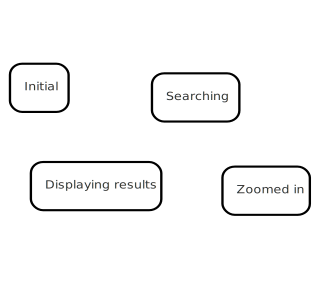
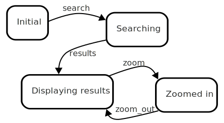
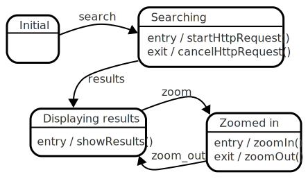

# How to use statecharts

This page tries to describe some aspects of employing statecharts in your day-to-day coding routine.

## Determine scope

When you first learn about statecharts, you might get the feeling that statecharts can be used to describe the _entire_ behaviour of an application, all the way from which screens show as part of logging in, to the state of each checkbox and text field in every screen, all represented in a statechart.  That would be a statechart from hell, and an even bigger maintenance burden.  Instead, the focus should be to get a grip on the **behaviour at the component level**, whatever a component might be.  A single screen would be a component, for sure.  A single text field that might have some particular internal behaviour (e.g. it changes color based on various flags like _required_ or _invalid_) might warrant that to be wrapped in a component with a statechart to describe its behaviour.

In general, try to structure your code as you did before, by dividing things up into components.  Try to use statecharts to describe the behaviour of _each_ component in isolation.  Use events and so on to get communication between components going just like before; keep the statechart _internal_ to the component itself.  The _user_ of the component shouldn't need to know that there's a statechart within it, other than by inspecting the code or guessing (since it behaves so well).

## Distill the API between the component and the statechart

To start using a statechart, the tangled mess that might be your component and its behaviour need to be disentangled: The _what_ / _how_ needs to be separated from the _why_.  You should end up with a business object that exposes functions that each does one useful part.

The communication between this business object happen in three distinct ways, and they usually execute in this order:

- Your object tells the statechart about an [event](glossary/event.html){:.glossary} — something happening either outside or inside the component. e.g. a keystroke, or a HTTP request response arrived.
- The statechart asks the world about some thing, known as a [guard](glossary/guard.html){:.glossary} — is the text field empty, or is the HTTP response complete
- The statechart tells your object to perform some [action](glossary/action.html){:.glossary} — tell the field that it's "invalid", or start parsing the results

These are the three touchpoints between the statechart and the outside world (your component).  Statecharts fit into an event driven system.  It accepts events, and turns them into actions.

## Decouple the component from the statechart?

At this point in time I think it's very useful to point out dependency that might come creeping.  The component in question easily becomes dependent on the states in the statechart.  A decision has to be made, or else it will be made for you.

The statechart invariably starts out as a reflection of the _modes_ that the component has, e.g. enabled, disabled, loading and so on.  It is therefore common to take the "current state" of the statechart and copy it into the component somewhere.  For a HTML based component, for example a top level CSS element, like `state-enabled` and `state-loading`.  This is completely natural, but introduces an implied coupling between the statechart and the component.

This coupling may or may not be beneficial, depending on how you end up using the statechart, but you should be aware of the coupling and the problems it introduces.  

| Decoupled | Coupled |
| --------- | -------- |
| The component doesn't know which state it's in | The component knows which state it's in |
| The component is explicitly _told_ when to change its mode, because the statechart says when _entering_ this state, _enter this mode_ | The component changes its mode automatically: whenever the statechart has handled an event, the component asks the statechart which state it's in and uses that |
| The component is explicitly _told_ when to do stuff, because the statechart says when _entering_ this state, _do this_ | The component does things based on the "current state": Whenever the statechart has handled an event, the component asks the statechart which state it's in and executes various functions |

* If you decide to keep them **decoupled**, it comes at the increased cost of having to define additional actions—an increased "API surface" if you will.  Additionally the statechart needs to have entry handlers (and possibly exit handlers) to turn on (and off) modes in the component.  The statechart needs to be able to control _explicitly_ what the component should be doing at any time.
* If you decide to keep them **coupled**, it comes at the cost of being able to make changes to the statechart itself.  Introducing a new state to make a behavioural change can no longer be done _purely_ on the statechart side, because this new state might _affect the component_ when it **should not**, or it might _not affect it_ when it **should**.  Often a change in the statechart has to be done along with a change in the component.


### Decoupled statecharts FTW

For long term durability and maintainability of statecharts, it is probably best to go "all in" and go with removing the dependency between the statechart and the component.  If you choose to do this, there are some notable things that the component _should not_ be worrying about, such as:

- _Which state is the statechart in?_ — It really doesn't matter. What matters are the actions that are called
- _Which transition just fired?_ — This too doesn't matter.

The things that matter in a decoupled statechart are: events, guards and actions.

## Designing a statechart

This is the biggest hurdle if you're new to statecharts, mainly because it is often such a foreign concept. You need to decide on the notation, if you want the benefit of a graphical representation, and ultimately which tools you'll choose.

Tools aside, the process of designing a component's statechart is to start by discovering the _modes_ of the component in question.  Those are good candidates for top level states of your statechart.  You can start to think about what events that take you between those states.  Remember, at the "top level" things don't need to be 100% precise; this is what the substates are for.  Finally you can add what _happens_ in each state: the entry and exit handlers.  These are basically just hooks in your component to start and stop things.

You should already have some crude state machine which does at least _some_ of the things you want the component to do.  The next step is to refine the states.

This is done by concentrating on each top level state and trying to discover if the component behaves in different ways when _in_ that state; if so then introduce substates, and repeat the process outlined above for that.

## Example

In order to explain this process, I'm going to try to walk you through the process that went into the design of the following component:  A simple search form.  It is modeled after the same UI as [Robust React User Interfaces with Finite State Machines](https://css-tricks.com/robust-react-user-interfaces-with-finite-state-machines/).

To quote the requirements of that article:

> * Show a search input and a search button that allows the user to search for photos
> * When the search button is clicked, fetch photos with the search term from Flickr
> * Display the search results in a grid of small sized photos
> * When a photo is clicked/tapped, show the full size photo
> * When a full-sized photo is clicked/tapped again, go back to the gallery view

Off the top of my head I can think of the following top level "modes"

* Initial — no search results are available
* Searching — when the search button was clicked
* Displaying results — when displaying results
* Zoomed in — when a photo is zoomed in on

If I put my statechart hat on, these can be thought of as "top level states"



And I can easily think of the transitions between those too.  Here's the "happy path" based on the requirements outlined above.

* Initial → Searching: someone typed something and hit the _Search_ button — I'll call this the **search** event
* Searching → Displaying results: the HTTP request completed with some data, the UI can be populated with stuff—I'll call this the **results** event.
* Displaying results → Zoomed in: The user clicked a photo and we now _zoom in_ on a particular photo.  I'll call this the **zoom** event
* Zoomed in → Displaying results: The user clicked a zoomed in photo and we now _zoom out_ back to the results.  I can call this the **zoom_out** event.

Again, these can be drawn into the statechart's "top level":



And similarly, I can sum up the _actions_ that should happen in each state:

* Searching:
  * on entry: fire HTTP request
  * on exit: cancel HTTP request (if still running)
* Displaying results:
  * on entry: parse the HTTP response and show some results
* Zoomed in:
  * on entry: zoom in on a particular photo
  * on exit: remove the zoomed-in photo

So with that, here's my initial stab at the statechart:



Now, if you're an experienced statechart designer, you can probably already see one big shortcoming of this statechart.  Luckily, with a diagram, they are extremely easy to discover:  There is no way to get from the "results" state back into the searching state.  There are no direct arrows pointing, and there is no path to get there.  I'm going to ignore this problem for now, because I want to show (later) how you can fix such problems _purely_ by making changes to the state machine.  So, if you spotted this by yourself, pat yourself on the back now.

### Initial implementation

At this point we have enough stuff to work on to be able to get an initial implementation running too, just to get the happy path running.  We can then check them off the list of "problems" that typically plague a quick implementation.

First off my preference is to code this statechart up in SCXML.  It'll give us a nice diagram and it's an _executable_ statechart, meaning I don't have to do any manual translation from this representation to code.  The SCION toolset can _run_ an SCXML file.

First off, the top level states:

```xml
<scxml>
  <state id="initial">
  </state>
  <state id="searching">
  </state>
  <state id="displaying_results">
  </state>
  <state id="zoomed_in">
  </state>
</scxml>
```

Let's add the transitions

```xml
<scxml>
  <state id="initial">
    <transition event="search" target="searching"/>
  </state>
  <state id="searching">
    <transition event="results" target="displaying_results"/>
  </state>
  <state id="displaying_results">
    <transition event="zoom" target="zoomed_in"/>
  </state>
  <state id="zoomed_in">
    <transition event="zoom_out" target="displaying_results"/>
  </state>
</scxml>
```

And then the entry/exit handlers.  Here's the full SCXML file, with namespace declaration and all.

```xml
<?xml version="1.0"?>
<scxml xmlns="http://www.w3.org/2005/07/scxml">
  <state id="initial">
    <transition event="search" target="searching"/>
  </state>
  <state id="searching">
    <onentry>
      <script>startHttpRequest();</script>
    </onentry>
    <onexit>
      <script>cancelHttpRequest();</script>
    </onexit>
    <transition event="results" target="displaying_results"/>
  </state>
  <state id="displaying_results">
    <onentry>
      <script>showResults();</script>
    </onentry>
    <transition event="zoom" target="zoomed_in"/>
  </state>
  <state id="zoomed_in">
    <onentry>
      <script>zoomIn();</script>
    </onentry>
    <onexit>
      <script>zoomOut();</script>
    </onexit>
    <transition event="zoom_out" target="displaying_results"/>
  </state>
</scxml>
```

I've [extracted this SCXML into its own file](how-to-use-statecharts-initial-actions.scxml.xml), styled for a certain amount of interactivity and ability to explore:

<iframe src="how-to-use-statecharts-initial-actions.scxml.xml" width="100%" height="500px"></iframe>

### API Surface

If we look at our _API surface_—the set of events, guards and actions that we have—we can start to compile a list of things that our UI needs to provide:

* Events: `search`, `results`, `zoom`, and `zoom_out`
* Guards: none (it's still quite a crude solution)
* Actions: `startHttpRequest`, `cancelHttpRequest`, `showResults`, `zoomIn`, and `zoomOut`

Note the absence of any data being passed back and forth: The events themselves are pretty anonymous; this is about high level things that happen in the UI. Likewise, the actions are no-arg function calls; no data is being passed from the statechart to the model.  They don't have to be function calls; it really depends on how you implement it. If you choose to, you can get the statechart to emit _events_ too, meaning that the component _listens_ for certain events from the state machine.


