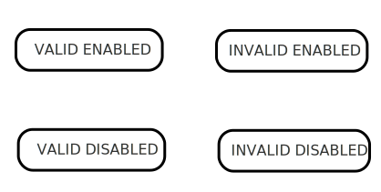
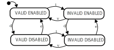
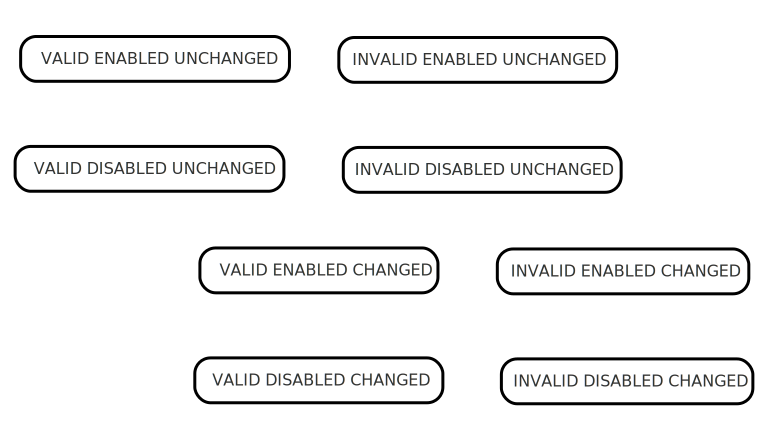
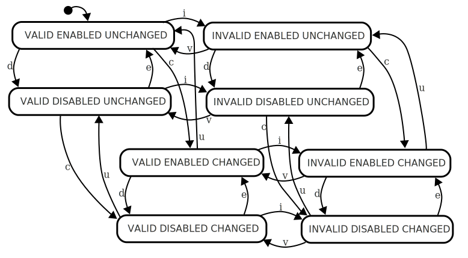

## State Machine: State Explosion

The main problem hampering wide usage of state machines is the fact that beyond very simple examples, state machines often end up with a large number of states, a lot of them with identical transitions.  Statecharts solve the state explosion problem.

A classic example is that of a user interface element that might be modeled as being _valid_ or _invalid_ and have a state machine that describes the behaviour.  Here is an example of such a simple state machine.

The machine starts in the Valid state, and upon receiving the events _i_ or _v_, transitions to the _invalid_ or _valid_ states, respectively.

Now let's say we wanted to allow the component to be enabled.  The _e_ event enables it, and the _d_ event disables it.  The state machine would need to know that a component is _enabled_ or _disabled_ .   With traditional state machines you end up with four states: _valid/enabled_, _invalid/enabled_, _valid/disabled_, and _invalid/disabled_.

To begin with, this doesn't look too bad, we've omitted the transitions.  First off, we need two sets of transitions for the existing _i_ and _v_ events, and we need similar transitions for the _e_ and _d_ events for _enable_ and _disable_.  In total we can see that in order to support four states, we need eight transitions:

Four states isn't such a big problem, see what happens when we add another feature that we want to model.  If we add a dirty bit to indicate that the user has made a change to the field, then we end up with state names like _valid/enabled/unchanged_ and a total of 8 states:

Some states might also not make sense to model; perhaps an unchanged field should not be considered invalid.  This simplifies the diagram somewhat, but not enough.  The real problem becomes apparent when you add the transitions to go with each new set of states:

What we are witnessing is referred to as the "state explosion" of state machines, because adding a new aspect to the state machine can sometimes double the number of states that need to be modeled, and creates a disproportionately high number of transitions.

The number of states needed to represent all possible combinations of variables is the [cartesian product](//en.wikipedia.org/wiki/Cartesian_product) of the sets of variables.

## Statecharts to the rescue

Statecharts address this problem by way of parallel states, hierarchies, and guards to name a few.

* [Parallel states](glossary/parallel-state.html){:.glossary} allow modeling independent variables truly independently of each other.
* Hierarchies (by way of [compound states](glossary/compound-state.html){:.glossary}) allow modeling variables that only carry meaning in some circumstances.
* [Guards](glossary/guard.html){:.glossary} allow modeling variables that depend on other variables.

## Parallel states

If we start out with the simple "valid / invalid" state machine:

Let's say that the enabled/disabled trait and changed/unchanged trait are completely independent of one another, in other words, that the machine can be in _any_ of the states.  If that's the case, then the independent variables can be modeled using a parallel state:

![Simple state machine with six states, and six transitions)(valid-invalid-enabled-disabled-changed-unchanged-parallel.svg)

We have six states, and six transitions, and clarity of thought.

## Hierarchies

In statecharts, states can be organized hierarchically.  When we want to model a new trait, we can attempt to understand how this new trait depends upon the existing states.  Perhaps the new trait only makes sense _sometimes_ and not _always_.

Let's say that we decide that the _valid/invalid_ trait only makes sense if the field has been modified.  In other words that if the field is _unchanged_ we don't care about the _validity_ of the field.  In order to model this, we can move the _valid/invalid_ states as _substates_ of _changed_:

/* statechart with valid/invalid as substate of changed. */

...

## Guards

A guard is a sort of _pre condition_ to a transition, in a way it stops a transition from happening if some condition is not true.

To illustrate how guards can help, let's go back to the parallel version of our statechart, but add the constraint that we can not go from changed to unchanged if we are in the invalid state.  In other words, we have to be _valid_ in order to go to _unchanged_.

We can do this by _guarding_ the transition from _changed_ to _unchanged_, adding the condition `in valid` (no pun intended) to the transition:

* [How to use statecharts](how-to-use-statecharts.html) 
