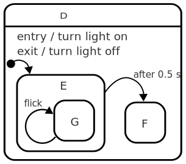

---
sitemap:
  lastmod: 2018-12-30
  priority: 0.8
---
## What is a statechart?

The primary feature of statecharts is that states can be organized in a _hierarchy_:  A statechart is a [state machine](what-is-a-state-machine.html) where each state in the state machine may define its own _subordinate_ state machines, called _substates_.  Those states can again define substates.

Here's an example of a state in a state machine, with some extra features:

* The state is called "D"
* E and F are substates
* E even has a substate G
* "entry" and "exit" actions are mentioned

When the state machine enters this state _D_ it also starts the state machine within it.  The _initial state_ of this machine inside _D_ is in fact _E_ so it _enters_ _E_ too.  And since _E_ has a single substate _G_, it is also _entered_.

> A state with no substates is called an [atomic state](glossary/atomic-state.html){:.glossary}.  A state with substates is called a [compound state](glossary/compound-state.html){:.glossary}.

### Entering a state enters one of its substates

- When a [state is entered](glossary/enter.html){:.glossary}, its sub state machine starts and therefore, a substate is entered
- When a [state is exited](glossary/exit.html){:.glossary}, its sub state machine is exited too, i.e. any substates also exit

In the example above, when the machine is told to enter _D_, it actually ends up entering _D_, _E_, and _G_.  Conversely, when the state machine exits _D_ it also exits any substates.

Like state machines, statecharts also react to events; events are _dealt with_ by the states and the main side effects are specified by what happens upon entering and exiting states.

### A state can have many "regions"

A compound state can be split up into completely separate ("orthogonal") regions.  Each region specifies its own state machine.  When a state machine enters such a state, it also enters _all_ of the regions of the state at the same time.

If this state is entered, then it enters both the top and bottom regions, and the following statements will hold true so long as A is active:

* Exactly one of B and C is active
* Exactly one of D and E is active 

Such a state is called a [parallel state](glossary/parallel-state.html){:.glossary}, and the regions are often called "orthogonal regions".

### Transitions can be guarded

When an event happens, and the state machine would normally transition from one state to another, statecharts introduce the concepts of _guarding_ the transition.  A [guard](glossary/guard.html){:.glossary} is a condition placed upon the transition, and the transition is essentially ignored if the guard condition is false.

### States can have multiple transitions for the same event

The addition of guards allows a state to have _more than one_ transition that reacts to the same event:  Two transitions fire on the same event, but only one is picked at run-time depending on which one's guards evaluate to TRUE.

### Transitions can happen automatically

When entering a state, a transition can be defined which is [automatically](glossary/automatic-transition.html){:.glossary} taken.  This is useful in conjunction with guards, to move out of a state immediately upon entering it when certain conditions hold, or as soon as those conditions hold.

### Transitions can be delayed

Simply being in a state for a duration of time can be enough to transition to a different state.  This is accomplished by way of a [delayed transition](glossary/delayed-transition.html){:.glossary}, which defines that the transition should be taken a specific period of time after entering a state.

### History 

When exiting a compound state and its substate, it is sometimes useful to be able to return to exactly the state that you left.  Statecharts introduce the concepts of [history states](glossary/history-state.html){:.glossary}.  When a transition goes _to_ a history state, it re-enters the state that "was last active".

### See also

To get a full explanation of the statechart shown above, see [the description of the on-off statechart](on-off-statechart.html).
